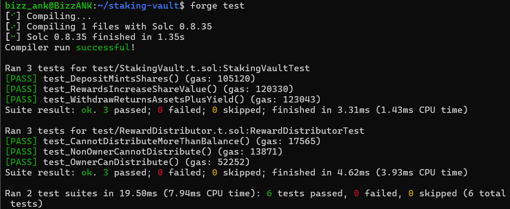
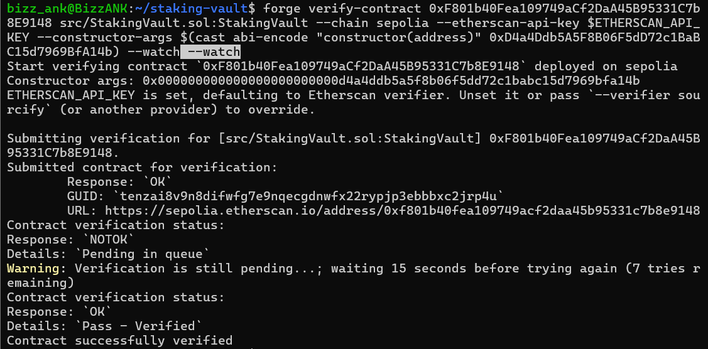
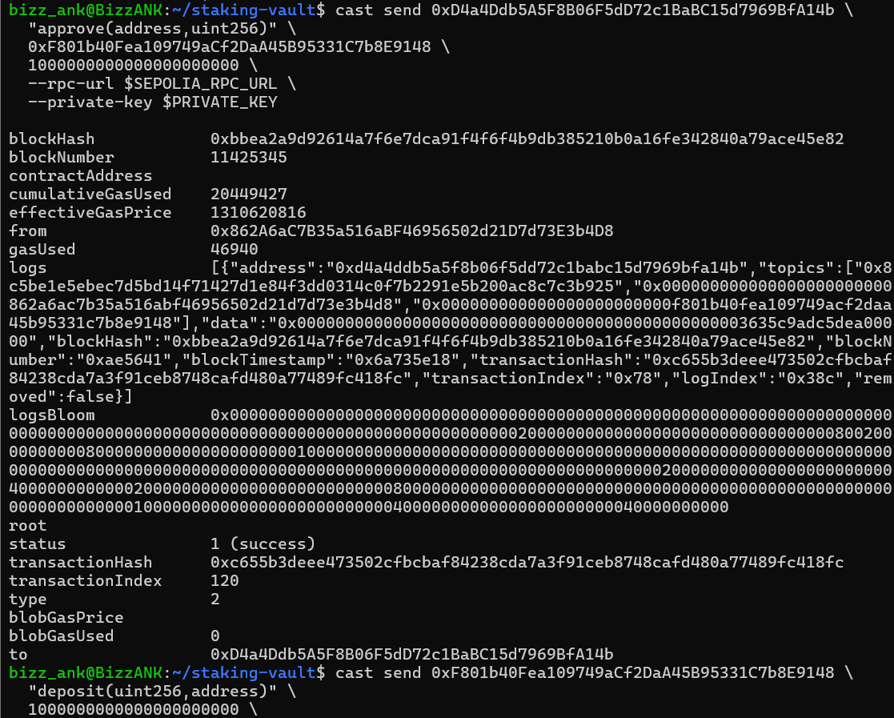
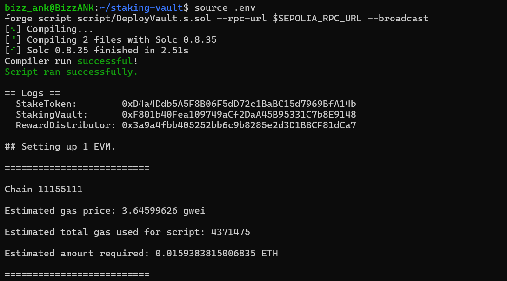

<h1 align="center">Staking Vault Protocol</h1>

<p align="center">
  An ERC-4626 staking vault where users deposit tokens, earn yield from distributed rewards, and withdraw their stake plus earnings — built and tested with a security-first approach.
</p>

<p align="center">
  
  
  
  
  
</p>

---

## Overview

A minimal but complete DeFi staking protocol built on the **ERC-4626** tokenized vault standard. Users deposit a token, receive vault shares, and those shares appreciate as rewards flow into the vault — so withdrawing returns the original stake plus accrued yield.

The focus is not novelty but **correctness and security**: audited building blocks, defensive patterns, and accounting proven to hold under tens of thousands of randomized operations.

---

## Live Deployment

All three contracts are deployed and **verified** on **Sepolia**:

| Contract          | Address                                                                                                                         |
| ----------------- | ------------------------------------------------------------------------------------------------------------------------------- |
| StakeToken        | [`0xD4a4Ddb5A5F8B06F5dD72c1BaBC15d7969BfA14b`](https://sepolia.etherscan.io/address/0xD4a4Ddb5A5F8B06F5dD72c1BaBC15d7969BfA14b) |
| StakingVault      | [`0xF801b40Fea109749aCf2DaA45B95331C7b8E9148`](https://sepolia.etherscan.io/address/0xF801b40Fea109749aCf2DaA45B95331C7b8E9148) |
| RewardDistributor | [`0x3a9a4fbb405252bb6c9b8285e2d3D1BBCF81dCa7`](https://sepolia.etherscan.io/address/0x3a9a4fbb405252bb6c9b8285e2d3D1BBCF81dCa7) |

The vault has processed a live deposit on-chain — verifiable in the StakingVault's transaction history.



---

## Features

| Feature                   | Root Idea                                          | Why it matters                                  |
| ------------------------- | -------------------------------------------------- | ----------------------------------------------- |
| ERC-4626 vault            | Deposit tokens, receive shares that track value    | Standardized, composable, audited base          |
| Reward-driven yield       | Rewards sent to the vault raise each share's value | No per-user reward bookkeeping required         |
| Access-controlled rewards | Only the owner can distribute, within balance      | Single auditable chokepoint, not a free-for-all |
| Safe transfers            | All token moves use OpenZeppelin `SafeERC20`       | Reverts on failure instead of failing silently  |

---

## How It Works

1. A user deposits 1,000 STK and receives vault shares.
2. The `RewardDistributor` sends 500 STK into the vault as rewards.
3. The share count is unchanged, but each share now redeems for more STK.
4. The user redeems their shares and receives ~1,500 STK — a 500 STK yield.

Yield is purely a function of the ERC-4626 share/asset math — no per-user reward tracking needed.

---

## Security

Built with the same lens I apply to auditing:

- **SafeERC20 for all transfers** — a raw `transfer` returns a boolean that, if unchecked, lets a failed transfer pass silently (a classic unchecked-return-value bug). All transfers use OpenZeppelin's `SafeERC20`, which reverts on failure.
- **Access-controlled reward distribution** — rewards flow through a single `onlyOwner` chokepoint with a balance check preventing over-distribution.
- **Share-inflation ("first depositor") defense** — built on OpenZeppelin's ERC-4626, which mitigates the attack via virtual shares/assets. Conversions round in the protocol's favor by design — observable in tests as redemptions rounding down by ~1 wei, which is the mitigation working, not a bug.
- **Immutable critical addresses** — the reward token and vault addresses are `immutable`, set once and untamperable.

---

## Tests

Unit tests cover every path, plus an invariant suite that stress-tests solvency.

| Test                                   | What it proves                               |
| -------------------------------------- | -------------------------------------------- |
| `test_DepositMintsShares`              | Deposit mints shares 1:1 for first depositor |
| `test_RewardsIncreaseShareValue`       | Rewards raise each share's redeemable value  |
| `test_WithdrawReturnsAssetsPlusYield`  | Redemption returns stake plus yield          |
| `test_OwnerCanDistribute`              | Owner can distribute rewards to the vault    |
| `test_NonOwnerCannotDistribute`        | Outsiders are blocked from distributing      |
| `test_CannotDistributeMoreThanBalance` | Over-distribution reverts                    |



**Invariant testing** — the core guarantee is that the vault is always solvent: it holds at least as many assets as its shares claim to be worth. Foundry stress-tests this with random deposit / withdraw / addRewards sequences — **128,000 operations per run**.

```
[PASS] invariant_vaultIsSolvent() (runs: 256, calls: 128000, reverts: 0)
```



Run them:

```bash
forge test              # unit tests
forge test --match-contract StakingVaultInvariantTest -vv   # invariant run
```

---

## Deployment

Deployed to Sepolia with a Foundry script:



---

## What a Production Version Would Add (v2)

This is a learning-grade implementation. A production protocol would:

- Stream rewards over time rather than distributing instantly
- Add a withdrawal fee or timelock to discourage reward-sniping (deposit right before a distribution, withdraw right after)
- Add pausability and emergency withdrawal paths
- Undergo a formal audit and a bug bounty before holding real value

---

## Built With

- Solidity ^0.8.20
- Foundry (forge, cast, anvil)
- OpenZeppelin Contracts (ERC-4626, ERC-20, Ownable, SafeERC20)
- Deployed & verified on Sepolia

---

## Acknowledgement

Built by **Amna Nasir** as part of a smart-contract security and DeFi engineering journey — applying a security-first mindset to a real multi-contract protocol.

If you have questions or suggestions, let's connect. GOOD LUCK BUDDY!
